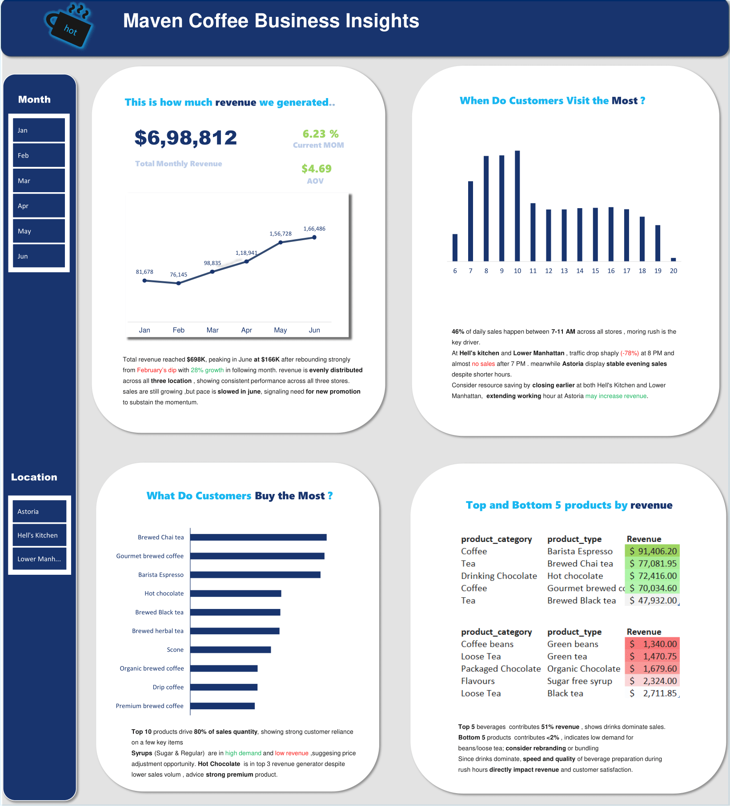

# BrewVista-Coffee-Sales-Analysis
Stakeholder type 

  

## 📌 Project Background 
BrewVista is a fictitious coffee shop chain operating across three locations in New York City — Astoria, Hell’s Kitchen, and Lower Manhattan. As a Data Consultant, I was tasked with analyzing sales transactions to develop a performance dashboard for the management team.

The report leverages 149K transaction records from January to June 2023, covering product types, sales, and customer traffic across the three locations. The objective was to transform raw sales data into actionable insights that reflect BrewVista’s performance over time, by product, and by location.

The analysis focused on uncovering sales trends, identifying top-selling products, evaluating product categories by revenue, and comparing traffic across store locations, providing the management team with insights to guide data-driven decision-making.

---

## Executive Summary
