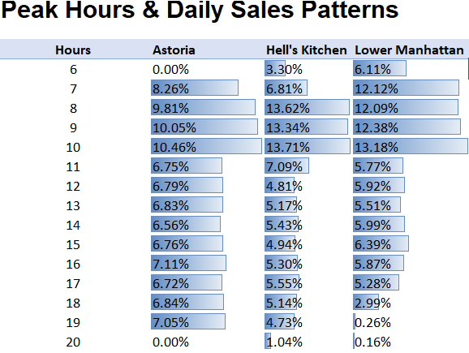

# BrewVista-Coffee-Sales-Analysis
Stakeholder type 

<!---->  

## 📌 Project Background 
BrewVista is a fictitious coffee shop chain operating across three locations in New York City — Astoria, Hell’s Kitchen, and Lower Manhattan. As a Data Consultant, I was tasked with extracting meaningfull insights from sale's data and providing actionable recommendations to improve performance across sales , product and marketing teams.

---

## Executive Summary
BrewVista earned **$698K** revenue (Jan–Jun 2023) with balanced sales across all stores. Sales **grew strongly** after February and peaked in June, though the pace has slowed. Beverages dominate with Coffee and Tea driving **66%** of revenue, while categories like Loose Tea and Packaged Chocolate remain weak. Astoria shows **steady demand** even with shorter hours, while evening traffic at Hell’s Kitchen and Lower Manhattan **drops sharply**.
To build on these trends, BrewVista could run fresh promotions to sustain growth, rebrand or bundle underperforming categories, extend hours at Astoria, and close earlier at low-traffic stores to save costs.

---

## Insights Deep-Dive

### Sales Trends And Growth Rates
- Total revenue reached $698K with overall upward trend. After a -6.7% dip in feburary, sales rebounded with 30% Growth in march with peaking in June at $166K.
- March-May accounts for  53% of revenue, hinting at seasonality with high bewrages demand in spring. 
- Although sales continue to grow , the paced has slowed by june, suggesting demand stabilization.
- Sales are evenly spread across all three NYC locations, indicating balance performance without reliance on single store.  

  

### Peak Hours & Daily Sales Patterns
- Sales surge during the morning rush (7–11 AM), contributing 46.2% of total sales, showing how critical these hours are for daily performance.
- Lower Manhattan and Hell's kitchen dominates morning rush with 54% of their daily sales between 7–11 AM, compared to 43% in Astoria.
- Between 2–5 PM, sales drop by 43% on average, suggesting untapped potential for snacks or promotional offers.
- Hell’s Kitchen and Lower Manhattan loses momentum sharply after 8 PM (-78%) and 7 PM (-91%) , whereas Astoria maintains steadier late-hour traffic despite shorter operating hours.

  

